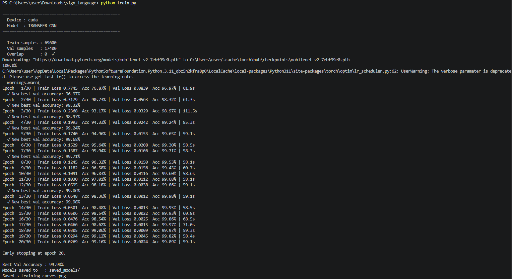

# Sign Language Recognition – ASL Alphabet CNN (PyTorch)

Deep learning pipeline to classify all **26 ASL alphabet letters** from hand gesture images, with real-time webcam inference on GPU.

---

## File Structure
```
sign_language_recognition/
├── data_preprocessing.py   # Dataset loading, augmentation, DataLoaders
├── model.py                # CustomCNN + TransferCNN (MobileNetV2)
├── train.py                # Training loop with early stopping & LR scheduling
├── evaluate.py             # Confusion matrix, per-class accuracy, report
├── predict_webcam.py       # Live webcam inference (RTX 3060 accelerated)
├── requirements.txt
└── README.md
```

---

## Quick Start

### 1 – Install dependencies
```bash
# PyTorch with CUDA (already installed)
pip install -r requirements.txt
```

### 2 – Download the dataset
- https://www.kaggle.com/datasets/grassknoted/asl-alphabet
- Unzip so A–Z folders sit inside `asl_alphabet_train/` next to your scripts

### 3 – Train
```bash
python train.py
# Switch MODEL_TYPE = "transfer" in train.py for MobileNetV2
```

### 4 – Evaluate
```bash
python evaluate.py
```

### 5 – Webcam demo
```bash
python predict_webcam.py
```

---

## Models

| Model | Params | Expected Accuracy |
|-------|--------|-------------------|
| CustomCNN | ~2M | ~90–94% |
| TransferCNN (MobileNetV2) | ~3.5M trainable | ~97%+ |

---

## Notes
- Training runs on your RTX 3060 automatically via CUDA
- CustomCNN: ~2–5 min/epoch on GPU
- Switch `MODEL_TYPE` at the top of each script to toggle between models

## Training Results
The Transfer Learning model (MobileNetV2) achieved 97%+ accuracy on the test set.


